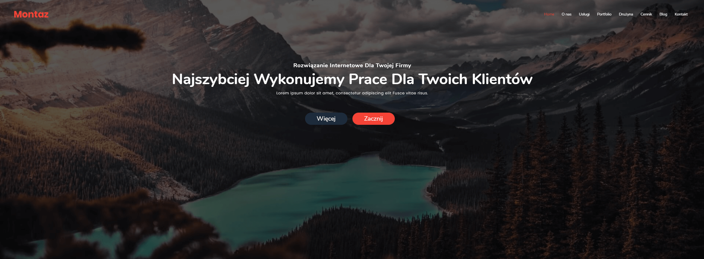
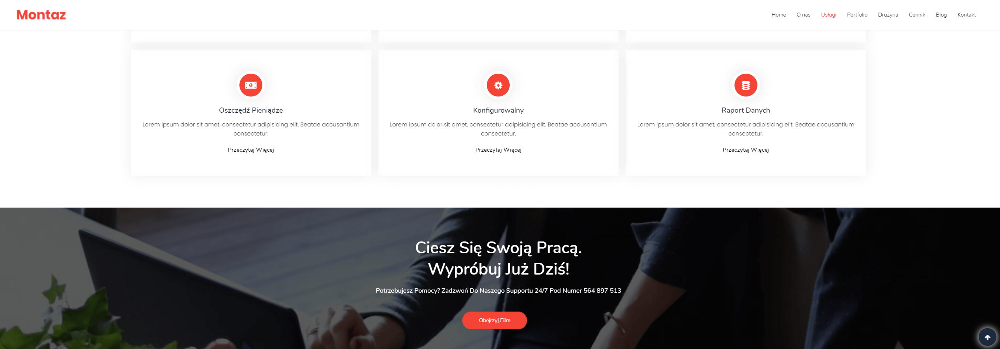
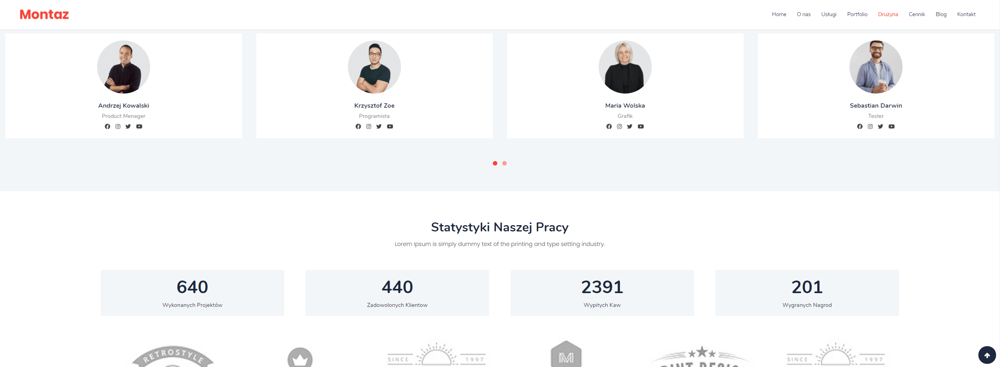
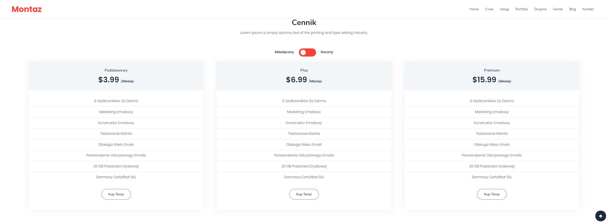

# 1# Montaz
> This is my first website.

> http://provo.webd.pro/montaz/

## Table of contents
* [General info](#general-info)
* [Screenshots](#screenshots)
* [Technologies](#technologies)
* [Status](#status)

## General info
As part of the training, I created this site following ~90% of the example on another site
> Unfortunatelly the original site is no longer available

I changed a few things that were implemented differently on the original version of the page.
e.g.
1. The original website based RWD entirely on bootstrap, and I did it with flex as part of the exercises
2. I added other animations and some extra ones
3. I used other libraries:
	* lightboxes
    * owlCarusel2
    * ScrollReveal

## Screenshots
### 1
### 2
### 3
### 4

## Technologies
* HTML
* CSS
* SCSS
* JavaScript
* jQuery

## Status
Project is: _finished_
